# Local Llama on MacBook Pro Max M2 64GB

## Bottom line first

- **Spec**: MacBook Pro Max M2 64GB
- **Model**: `unsloth/Qwen3.6-35B-A3B-MTP` @ `UD-Q4_K_XL`
- **Fast Model**: `unsloth/gemma-4-E4B-it-qat` @ `UD-Q4_K_XL`
- **Application**: `llama.cpp`
- **MTP**: on
- **KV-Cache**: `f16`
- **Harness**: Qwen Code
- **OS**: macOS Tahoe 25.5-25.6

I've tested multiple models and quants on MBP with 64GB of RAM, and found one good option for agentic coding with large context (>**128k**): Qwen3.6 35B A3B. The model works at around **60-70** t/s at small context, and is still holding up well at **128k** with **35** t/s. It has **3B** active parameters, which M2 can handle well.

I did test other models' performance and quality, as well as MTP vs base versions and various compressions of KV cache.

### Learnings

- MTP still holds up well at larger contexts
- Any KV key compression degrades performance; `f16` is the optimal one
- MTPLX is slightly faster than `llama.cpp` on token generation on some models, but slower on prefill
- It is possible to fit Qwen 3.6 35B A3B and Gemma 4 E4B in MacBook Pro Max M2 with **64GB**, but there is not much room left for other apps.
- Qwen 3.6 27B @ `UD-Q4_K_XL` has much better quality. Not Sonnet 5 or Gemini 3.6 Flash level, but can do a decent job with decent prompting. But it is too slow. Almost 3-4x as slow as Qwen 3.6 35B A3B, making it very hard to use in agentic coding.
- Qwen 3.6 35B A3B @ `UD-Q4_K_XL` is significantly worse than 27B, and requires a lot of prompts and guardrails to ensure quality. But speed is very good—only **2-3** times slower than cloud models (Sonnet 5, Gemini 3.6 Flash).
- Gemma 4 26B A4B works on simple tasks, but fails to complete anything more complex. Reasoning loops and tool use issues prevent it from finishing anything.

## Intro

I stumbled upon a [blog post](https://ai.georgeliu.com/p/running-google-gemma-4-locally-with) on Hacker News. It described how to use Gemma 4 26B A4B on MacBook Pro M4 Pro 48 GB. And it looked like it might actually work. I tried LLAMA and a few other models a long time ago, and they were unusable on my work MacBook Pro M1 32GB, or even on my home MacBook Pro Max M2 64GB. I tried it with OpenCode and was not able to do any work with old models. But it seemed like new ones were actually good. So I decided to try it myself.

## Requirements

- Comfortable work with C# for backend, TypeScript for frontend, Python for ML and scripts, Swift for iOS applications.
- Context size: no need for small context, work will start at 15-20k, and go to 80-128k. Should still be ok at 160k (ideally up to 200k).
- Work on MacBook Pro Max M2 64GB

## Scope

What was tested?

**Models**:

- **Small**
  - `Qwen/Qwen3.5-4b`
  - `google/gemma-4-e2b`
  - `google/gemma-4-e4b`
  - `unsloth/qwen3.5-4b`
  - `unsloth/gemma-4-E2B-it-qat`
  - `unsloth/gemma-4-E4B-it`
  - `unsloth/gemma-4-E4B-it-qat`
- **MoE**
  - `openai/gpt-oss-20b`
  - `google/gemma-4-26B-A4B`
  - `Qwen/Qwen3.6-35B-A3B`
  - `unsloth/gemma-4-26B-A4B-it-qat`
  - `unsloth/Qwen3.6-35B-A3B`
  - `unsloth/Qwen3.6-35B-A3B-MTP`
- **Dense**
  - `google/gemma-4-12b`
  - `google/gemma-4-31B`
  - `unsloth/gemma-4-12b-it-qat`
  - `unsloth/gemma-4-31B-it-qat`
  - `unsloth/Qwen3.6-27B`
  - `unsloth/Qwen3.6-27B-MTP`

**Apps**:

- [Ollama](https://ollama.com/)
- [LM Studio](https://lmstudio.ai)
- [MTPLX](https://mtplx.com/)
- [llama.cpp](https://github.com/ggml-org/llama.cpp)

**Variations**:

- Base
- MTP
- MLX
- DFlash

**Quants**:

- Q6_K
- Q4_K_M
- UD-Q4_K_XL

**KV-Cache**:

- f16/f16
- q8_0/q8_0
- q8_0/turbo2
- q8_0/turbo3

**Harness**:

- [Claude Code](https://code.claude.com/docs/en/overview)
- [OpenCode](https://opencode.ai)
- [Qwen Code](https://qwen.ai/qwencode)
- [Crush](https://github.com/charmbracelet/crush)
- [Pi](https://pi.dev)
- [Kilo Code](https://kilo.ai)

## Initial model tests

I started with a few models in Ollama (I was familiar with it and used it before):

- `gpt-oss:20b`
- `gemma4:e2b`
- `gemma4:e4b`
- `gemma4:12b`
- `gemma4:26b`
- `gemma4:31b`
- `qwen3.6:27b-mlx`
- `qwen3.6:35b`
- `qwen3.6:35b-mlx`

I wrote a small testing tool to probe each model and measure performance: one for C# code refactoring, another for TypeScript code refactoring. And I was manually judging how each model performed. Both tasks had fairly small context sizes.

MacBook Pro Max M2 64GB:

| Model | TTFT (s) | Speed (t/s) | Notes |
| :--- | :--- | :---: | :--- |
| `gpt-oss:20b` | < 2 | ~65 | |
| `gemma4:e2b` | ~10 | ~98 | |
| `gemma4:e4b` | ~7-8 | ~61 | |
| `gemma4:12b` | 25-40 | 28-31 | |
| `gemma4:26b` | 16-21 | 61-62 | |
| `gemma4:31b` | 40-66 | 13-14 | |
| `qwen3.6:27b-mlx` | 1-20 | 17-18 | |
| `qwen3.6:35b` | 1-3 | 63-64 | |
| `qwen3.6:35b-mlx` | 1-3 | 68-69 | Ollama seems to support MLX now |

If we look at the speed, we can make the following conclusions:
- `gpt-oss:20b`, `gemma4:e4b`, `gemma4:26b`, `qwen3.6:35b` and `qwen3.6:35b-mlx` were very good and all were around 60-70 t/s. Which is amazing.
- `gemma4:e2b` was around 98 t/s, which is also good.
- `gemma4:12b` was acceptable too.
- But `gemma4:31b` and `qwen3.6:27b-mlx` were too slow.

But based on the actual code quality, there was a different picture:

| Model / Family | Code Quality & Findings |
| :--- | :--- |
| `gpt-oss:20b` | Very good code quality, identified issues and proposed flawless refactorings. Supports max 128k context. |
| `qwen3.6:*` | Very high quality C# code, good TypeScript refactorings. EOS missing on MLX variants occasionally. |
| `gemma4:*` | Poorer framework knowledge. `gemma4:26b` suggested very bad C# code. `gemma4:e2b` and `gemma4:e4b` produced overly complicated TypeScript code. |

One more note: MLX variants had higher t/s, but TTFT was slightly higher on these two simple tests.

> **Note:** All tests were done around the first week of June 2026.

**Bottom line**: MBA can handle only `gemma4:e4b` with decent speed, and maybe `gpt-oss:20b` for tiny contexts. MBP has `gpt-oss:20b` and `qwen3.6:35b` models tied, and `gemma4:e4b` as a second model with similar performance, worse quality, but less memory usage. I decided not to use `gemma4:26b` for now, as it was not much better than the two leaders, while memory was only slightly lower.

## Initial harness testing

**Models**: Gemma 4 E4B, GPT OSS 20B, Qwen 3.6 35B
**Harness**: undecided

I tried to run OpenCode with the 3 models I chose in the initial test in Ollama: `gpt-oss:20b`, `qwen3.6:35b` and `gemma4:e4b`.

And all of them failed miserably. `gpt-oss:20b` and `gemma4:e4b` were able to produce some response, but tool calling was not working. `qwen3.6:35b` would do one or two turns and halt.

I decided not to go with `gpt-oss:20b` because of the maximum 128k context size.

I did some research and the leading theory was that quantization was screwing up tool calling. So I started looking at other variants.

Little did I know, the tool calling issue and execution loop halt had nothing to do with quantization.

### Ollama chat template quirks

OpenCode was able to run a few turns against the model, and then at some point it would just stop.
<figure>
  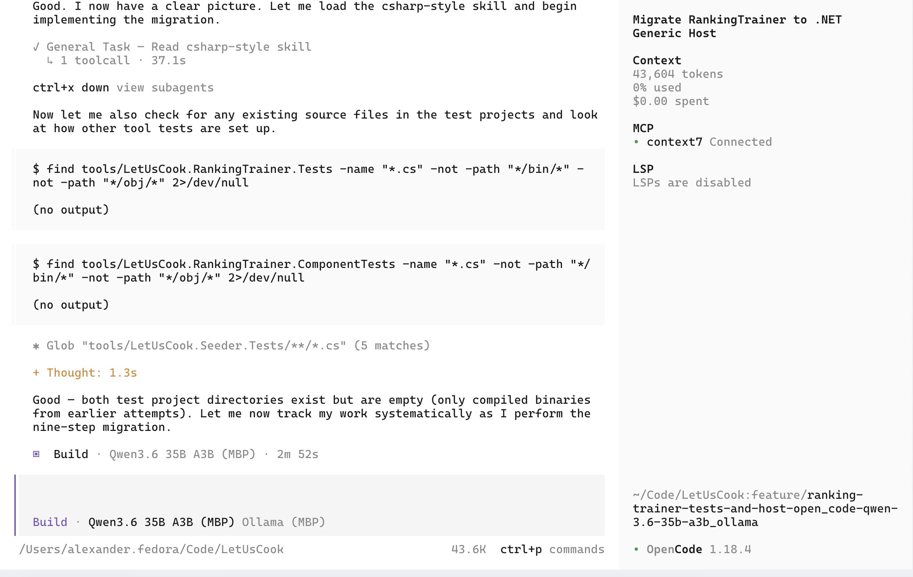
  <figcaption><strong>Figure 1:</strong> Execution loop halt in OpenCode caused by Ollama's Go chat template handling.</figcaption>
</figure>

It was taking many tries for me typing "continue" to get the task done. After a long journey I did understand the root cause of the execution loop halt. But back then it was very frustrating.

Here is the issue: Ollama is not using Jinja templates, which are used by default in tools like LM Studio. It is using Go templates, and trying to convert or match the model's chat template to Go templates. And doing a bad job at it.

I didn't get into the exact issue, but can reproduce it very easily. By default Ollama spawns a `llama-server` with the following parameters:

```sh
/Applications/Ollama.app/Contents/Resources/llama-server \
  --model ~/.ollama/models/blobs/{hash} \
  --port 60607 \
  --host 127.0.0.1 \
  --no-webui \
  --offline \
  -c 262144 \
  -np 1 \
  --log-verbosity 4 \
  --no-log-prefix \
  --no-log-timestamps \
  --no-jinja \
  --chat-template chatml \
  --mmproj ~/.ollama/models/blobs/{hash} \
  --flash-attn auto \
  -b 1024 \
  -ub 1024 \
  --context-shift \
  --keep 4
```

The important part is `--no-jinja --chat-template chatml`. Ollama is using ChatML format with their Go templates. If we replace this exact part with `--jinja`, we will have:

```sh
/Applications/Ollama.app/Contents/Resources/llama-server \
  --model ~/.ollama/models/blobs/{hash} \
  --port 8808 \
  --host 0.0.0.0 \
  --no-webui \
  --offline \
  -c 262144 \
  -np 1 \
  --log-verbosity 4 \
  --no-log-prefix \
  --no-log-timestamps \
  --jinja \
  --mmproj ~/.ollama/models/blobs/{hash} \
  --flash-attn auto \
  -b 1024 \
  -ub 1024 \
  --context-shift \
  --keep 4
```

And if we kill Ollama, start the server manually, and then point OpenCode to port 8808, it will be able to finish tasks to completion without halting.

### Qwen Code context pollution of Gemma 4 models

After spending some time with Qwen Code, I was finally able to figure out why Gemma 4 was not stable.

Smaller models, especially E2B and E4B, were confused by the Qwen Code system prompt. It had a few tool calling examples, which were overriding the internal tool calling convention of the model.

Gemma 4 12B and Gemma 4 26B A4B were a little bit better. 12B still was confused much more frequently. It would work for a few turns, and then forget and try to use `[tool_call: ...]` format, which is not detected by `llama.cpp` chat template. Instead of converting it to OpenAI API format, it would print it as text.

```text
> print today's date using `date` shell command
  ∴ Thought for 1s (option+t to expand)
◆ I'll run the date shell command to print the current date and time.
    [tool_call: run_shell_command for 'date' with description: 'Prints the current date and time']
```

<figure>
  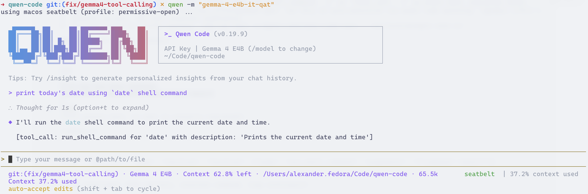
  <figcaption><strong>Figure 2:</strong> Gemma 4 outputting raw text tool calls due to Qwen Code system prompt format mismatch.</figcaption>
</figure>

I finally found the issue in the system prompt. It had many examples with the wrong format, which was polluting Gemma 4's context with wrong tool calling format, overriding its training.

```xml
<example>
user: start the server implemented in server.js
model: [tool_call: run_shell_command for 'node server.js' with is_background: true because it must run in the background]
</example>
```

I tried to override it with instructions like this (~/.qwen/QWEN.md):

```markdown
### SYSTEM DIRECTIVE: NATIVE TOOL CALL PROTOCOL
You are running on a native Gemma 4 inference engine. You must execute tool calls using your native tokenized syntax. Never emit generic XML tags, raw JSON, or markdown blocks for tool execution.

NATIVE FORMAT SCHEMA:
<|tool_call>call:tool_name{parameter_name:<|"|>value<|"|>}<tool_call|>

CONSTRAINTS:
1. Never generate XML tags like <tool_call: ... /> or [tool_call: ... ].
2. Do not write a conversational preamble before emitting the tool call.
3. Wrap all string arguments exactly with the native <|"|> delimiters.
4. ABSOLUTE PATHS ONLY: All file-based tools (read_file, write_file, edit) must use fully qualified absolute paths (e.g., ~/repo/file.txt). Never use relative paths (e.g., docs/PROJECT.md). If the absolute workspace root is unknown, execute `pwd` via run_shell_command to find it before interacting with files.

1-SHOT EXAMPLE:
User: Run the date command to check the system time.
Agent: <|tool_call>call:run_shell_command{command:<|"|>date<|"|>,description:<|"|>Check the current system time.<|"|>}<tool_call|>
```

And it worked, but would still regress once in a while. I was able to fully fix it by saving, fixing, and replacing the system prompt. But it was not that convenient. So I fixed the issue in Qwen Code itself, and now Gemma 4 works fine out of the box without any hacks: [QwenLM/qwen-code/pull/7177](https://github.com/QwenLM/qwen-code/pull/7177)

## Re-selecting models with better quantization

In order to try to fix tool calling in Claude Code and OpenCode, I tried to select better models with better quantization:

- `batiai/qwen3.6-35b:q6` - higher than 4-bit default Ollama quantization
- `gemma4:e4b-it-qat` - replaced `gemma4:e4b`
- `gemma4:12b-it-qat` - replaced `gemma4:12b`
- `gemma4:26b-a4b-it-qat` - replaced `gemma4:26b`
- `gemma4:31b-it-qat` - replaced `gemma4:31b`

I re-tested all gemma4 models. The performance was comparable:

| Model | TTFT (s) | Speed (t/s) |
| :--- | :--- | :---: |
| `gemma4:e4b-it-qat` | ~3-10 | ~66-67 |
| `gemma4:12b-it-qat` | 25-40 | ~33 |
| `gemma4:26b-a4b-it-qat` | 17-22 | 68-69 |
| `gemma4:31b-it-qat` | 49-72 | 15-16 |
| `batiai/qwen3.6-35b:q6` | 1-3 | ~58 |

QAT for Gemma 4 models didn't change performance much. Switching from 4 to 6 bits for Qwen 3.6 35B A3B reduced t/s from 63 to 58.

I found the quality of code produced by `gemma4:26b-a4b-it-qat` slightly better than `gemma4:26b`.

For `batiai/qwen3.6-35b:q6`, code quality was great. For `gemma4:31b-it-qat`, code was better too. I didn't do too many iterations to compare, but from the start all models that had better quantization seemed to have better code quality in my limited tests.

> **Note (1) — Quality:** For this round, I took all answers from local LLMs, and then ran them through cloud models to judge results. And then did a review of all findings. The review was fairly accurate.

> **Note (2) — Baseline comparison:** Original post from georgeliu says he was able to get 51 t/s on MacBook Pro M1 48GB with Gemma 4 26B A4B. M2 has more GPU cores and higher memory bandwidth, which allows getting an extra ~30% of token generation speed.

## Trying again in harness

**Models**: Gemma 4 12B IT QAT, Gemma 4 26B A4B IT QAT, Gemma 4 31B IT QAT, Qwen 3.6 35B
**Harness**: undecided

I tried again in OpenCode with the selected models: `gemma4:12b-it-qat`, `gemma4:26b-a4b-it-qat`, `gemma4:31b-it-qat` and `batiai/qwen3.6-35b:q6`.

`gemma4:12b-it-qat` had issues with tool calling. `gemma4:31b-it-qat` was too slow. So only two models were left: `gemma4:26b-a4b-it-qat` and `batiai/qwen3.6-35b:q6`.

I tried to change the harness to Kilo. And for the first time I was able to get Qwen 3.6 35B to complete tasks fully from start to finish!

Then I tried Qwen Code and it worked even better with Qwen 3.6 35B. But it had tool calling issues with `gemma4:26b-a4b-it-qat`. I didn't know it was because of Ollama's chat template, so I thought it was still because of quantization. Next I decided to try to squeeze more quality out of using other variations of the models.

## Unsloth Models

In addition to new versions of the models, I also decided to re-evaluate which model to use for a fast model. Qwen Code allows using a fast model for summarization, memory extraction, sub-agents, etc. If I can fit a larger 200-256k model into memory, and still have space for a tiny model, that would be great. I tried `qwen/qwen3.5-4b` and `unsloth/qwen3.5-4b`, but they both had terrible TTFT (> 40 seconds, I have no idea why it was so bad, may be misconfiguration), so I ended up choosing the only viable option: `unsloth/gemma-4-E4B-it-qat`.

For next evaluations, I built a slightly more complex benchmark, which would run various tests—not only small, but larger ones. And I decided to try to test Unsloth variants of the models I chose. I used new tests, so performance had a slightly different baseline compared to previous tests. But on average it was very good.

- `unsloth/gemma-4-e4b-it-qat` - TTFT <5 seconds, ~80 t/s
- `unsloth/qwen3.6-35b-a3b` - TTFT 15-25 seconds, 52-55 t/s (NOTE much higher TTFT and lower t/s because new tests had much larger system prompt and initial context)

It was a no-brainer because of a smaller memory footprint. So I decided to stick with Unsloth variants for the next comparison.

## Ollama vs LM Studio & MTP

In an effort to get more performance, I tried to find if other applications could give more speed. I used to run llama.cpp a long time ago. But I remembered it being not easy, requiring manual file downloads and a zillion parameters. So I wanted to try something out of the box.

Also I read about the very recent release of MTP support and wanted to try it out.

So here is a comparison of performance of LM Studio (headless CLI) vs Ollama. I've also added `unsloth/qwen3.6-35b-a3b-mtp` to the mix.

I noticed a slightly higher performance from LM Studio in my tests. But the problem was that Ollama was not able to run MTP. I saw about a +40% performance increase in LM Studio when I was using `unsloth/qwen3.6-35b-a3b-mtp`, but in Ollama it was the same. Seems like when I was testing, Ollama was not supporting MTP at that time. It seems like it is now, but I have not tested it again.

The weird thing was, I was still seeing quirks in OpenCode or Qwen Code when working with Ollama, but it worked much better in LM Studio. Not only that, code quality seemed worse in Ollama than in LM Studio.

After some digging, I figured out the problem with quality: when I was downloading the Unsloth variant for Ollama, I did not specify a quant. And it downloaded a default one: `UD-Q4_K_M`. In LM Studio I was using `UD-Q4_K_XL`. Again, it seems like there should not be that big of a difference between the two versions, but in tests I saw a difference. Perhaps I was lucky. And to be fair, I saw the quality issue and was investigating it before I learned about the differences. Otherwise I'd think I was biased to think a higher quant would produce higher quality. So I still think `UD-Q4_K_XL` produces higher code quality than `UD-Q4_K_M`, but I'd not put very high certainty on it because from the information I have they should not be that different.

While testing differences between Ollama and LM Studio, I updated my local llama.cpp and ran the tests against models downloaded by either of the tools using manual arguments I learned by inspecting what Ollama was doing. After downloading the proper quant to Ollama, I saw no differences, so I concluded the models are actually the same. But then I tried to use llama.cpp directly in OpenCode, and figured out I needed to use `--jinja`. And suddenly OpenCode was able to finish work without execution loop halts even using models from Ollama cache. That gave me the clue—Ollama is the problem, not the quantization.

> **Note:** Ollama and LM Studio were installed as latest from brew.

## Testing other harnesses

**Models**: `unsloth/gemma-4-e4b-it-qat`, `unsloth/Qwen3.6-35B-A3B-MTP`, `unsloth/gemma-4-26B-A4B-it-qat`
**Harness**: Qwen Code as primary, Open Code as backup

Next, I installed a few more harnesses side by side:

- Kilo
- OpenCode
- Qwen Code
- Crush
- Pi

Kilo and OpenCode are very similar. I don't like the TUI of either of them, so I decided to keep OpenCode in the selection and try others.

I really liked Qwen Code as a harness. Very familiar with it as I used Gemini CLI for a long time. And it feels much better than OpenCode. I decided this would be my harness of choice.

<figure>
  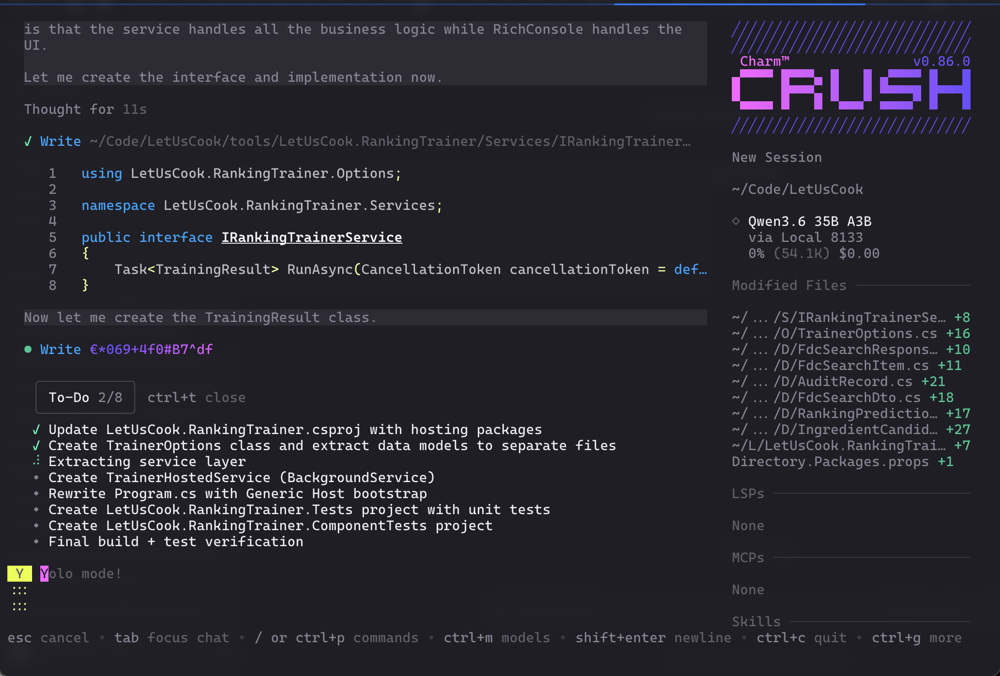
  <figcaption><strong>Figure 3:</strong> Demonstration of Crush harness running with Qwen 3.6 35B A3B.</figcaption>
</figure>

I loved Crush, but it seems like it is at the very start of its development, and not as feature-rich as Qwen Code or OpenCode. Would love to try it again when it becomes more mature.

I did try to use two more harnesses:

- Claude Code - it is great for Anthropic models, but for local models it is too verbose. It was using context too fast. Seems like Anthropic is now optimizing for 200k-1000k context windows, so they can be more verbose than others. So I decided not to use it.
- Pi - nice minimalistic harness. But I like something more complete out of the box. Perhaps sometime in the future, I will try to configure it to work exactly how I like, similar to NeoVim. But for now I would rather use **Qwen Code**.

## llama.cpp

The next thing was to try to find how much performance I could squeeze from my setup.

I compiled llama.cpp from source from master, latest tests done with:

```text
version: 10154 (0e4a03622)
built with AppleClang 21.0.0.21000101 for Darwin arm64
```

In the same post on Hacker News I saw a [comment](https://news.ycombinator.com/item?id=47659626) that had a link to documentation on how to use llama.cpp on MacBook Pro Max M1 64GB - [pchalasani.github.io/claude-code-tools/integrations/local-llms/](https://pchalasani.github.io/claude-code-tools/integrations/local-llms/). Since that was very close to my spec, I decided to start from there.

```bash
llama-server \
  -hf unsloth/Qwen3.6-35B-A3B-GGUF:UD-Q4_K_XL \
  --port 8133 \
  -ngl 999 \
  --threads 8 \
  -c 65536 \
  -b 2048 \
  -ub 1024 \
  --parallel 1 \
  -fa on \
  --jinja \
  --keep 1024 \
  --swa-full \
  --no-context-shift \
  --chat-template-kwargs '{"enable_thinking": false}' \
  --temp 0.7 \
  --top-p 0.8 \
  --top-k 20 \
  --min-p 0.00 \
  --no-mmap
```

The whole page was very informative, but I needed slightly more - MTP support and enabled thinking.

```bash
llama-server \
  -hf unsloth/Qwen3.6-27B-MTP-GGUF \
  -hff Qwen3.6-27B-UD-Q4_K_XL.gguf \
  --mmproj ~/.cache/huggingface/hub/models--unsloth--Qwen3.6-27B-MTP-GGUF/snapshots/5cb35eb3dcbf52dbce5f87dbc64df6aaffadcace/mmproj-BF16.gguf \
  --alias "unsloth/Qwen3.6-27B-MTP" \
  -c 262144 \
  -np 1 \
  -ngl 99 \
  -fa on \
  -b 2048 \
  -ub 2048 \
  -t 8 \
  --temp 0.6 \
  --top-p 0.95 \--chat-template-kwargs '{"enable_thinking": false}'
  --top-k 20 \
  --min-p 0.00 \
  --repeat-penalty 1.0 \
  --presence-penalty 0.0 \
  --host 0.0.0.0 \
  --port 64291 \
  --spec-type draft-mtp \
  --spec-draft-n-max 3 \
  --keep 1024 \
  --swa-full \
  --no-mmap \
  --no-context-shift \
  --reasoning on \
  --reasoning-preserve \
  --no-webui \
  --offline \
  --jinja
```

Some arguments are specific to Qwen:

```bash
  --temp 0.6 \
  --top-p 0.95 \
  --top-k 20 \
  --min-p 0.00 \
  --repeat-penalty 1.0 \
  --presence-penalty 0.0 \
```

MTP works really well with a 3-token draft (I tried 2, 3 and 4; seems like 3 works best with a high acceptance rate—4 had a lower acceptance rate and did not add much speed):

```bash
  --spec-type draft-mtp \
  --spec-draft-n-max 3 \
```

Attention arguments:

```bash
  -fa on \
  --swa-full \
```

Disable dynamic context shifting (I'd rather fail than silently lose context):

```bash
  --no-context-shift \
```

Allocate enough threads from the M2 CPU:

```bash
  -t 8 \
```

Move computation to GPU only, and do not use MMAP—load everything into memory:
```bash
  -ngl 99 \
  --no-mmap \
```

Use a 256k context window:

```bash
  -c 262144 \
```

Allow one client at a time (affects KV Cache allocation):
```bash
  -np 1 \
```

Use optimal buffer sizes:
```bash
  -b 2048 \
  -ub 2048 \
```

I got the numbers by running llama-bench:

```bash
llama-bench -m gemma-4-E4B-it-qat-UD-Q4_K_XL.gguf -p 4096 -b 512,1024,2048,4096 -ub 512,1024,2048,4096
```

It runs various combinations of logical and physical batch sizes. On MacBook Pro Max M2, a logical batch of 2048 and a physical batch of 2048 was optimal.

On the same set of tests, I was able to increase t/s for the MTP variant of Qwen 3.6 35B A3B by a few t/s. Not a drastic change:

- `unsloth/qwen3.6-35b-a3b` - 52-55 t/s
- `unsloth/qwen3.6-35b-a3b-mtp` - ~76 t/s
- `unsloth/qwen3.6-35b-a3b-mtp` + llama.cpp tuning - ~79 t/s

I wrote a small Zsh script to start / stop llama.cpp with various models, and ditched LM Studio and Ollama.

> **Note:** Most of the tests were done around the end of June 2026.

## Memory Management

I tried to figure out how I could run two models on MacBook Pro Max M2 64GB at the same time. I don't need 256k for the small model anyway, so I can lower it to 64k and keep as much memory as possible for the larger model.

Also, since I have 2 laptops, I can use MacBook Air M4 32GB as a development machine and allocate as much memory as possible on MacBook Pro for local LLMs.

`unsloth/gemma-4-E4B-it-qat` with a context of 64k takes about 7.6GB of RAM. And if we unlock more RAM for LLMs with `sudo sysctl iogpu.wired_limit_mb=59392`, we can comfortably run Qwen 3.6 35B A3B with a 236k context window, and all other models with a 256k context window.

> **Note:** `sysctl iogpu.wired_limit_mb=59392` will not persist across reboots.


| LARGE MODEL | L-CTX | L-BASE (GB) | L-OVHD (GB) | L-KV (GB) | L-TOTAL (GB) | S-BASE (GB) | S-OVHD (GB) | S-KV (GB) | S-TOTAL (GB) | TOTAL ML VRAM (GB) | TOTAL RAM INC OS (GB) |
| --- | --- | --- | --- | --- | --- | --- | --- | --- | --- | --- | --- |
| Qwen3.6-35B-A3B-MTP | 236k | 21.9 | 10.6 | 11.8 | 44.3 | 3.9 | 2.2 | 1.5 | 7.6 | 51.9 | 56.9 |
| Qwen3.6-27B-MTP | 256k | 17.9 | 9.5 | 10.5 | 37.9 | 3.9 | 2.2 | 1.5 | 7.6 | 45.5 | 50.5 |
| Gemma-4-31B-it-qat | 256k | 16.0 | 11.0 | 11.5 | 38.5 | 3.9 | 2.2 | 1.5 | 7.6 | 46.1 | 51.1 |
| Gemma-4-26B-A4B-it-qat | 256k | 13.0 | 8.8 | 10.0 | 31.8 | 3.9 | 2.2 | 1.5 | 7.6 | 39.4 | 44.4 |
| Gemma-4-12B-it-qat | 256k | 6.3 | 4.6 | 6.6 | 17.5 | 3.9 | 2.2 | 1.5 | 7.6 | 25.1 | 30.1 |

> **Note:** L-OVHD and S-OVHD are measured overhead. It scales with context size.

If I do need to run more applications on MBP along with Qwen 3.6 35B A3B, I'd need to stop Gemma 4 E4B, or reduce context window on the model to consume less memory. Gemma 4 26B A4B on the other hand is the sweet spot. It is close to Qwen 3.6 35B A3B, but consumes less memory. So I'd probably do that instead.

**Bottom line**: Gemma 4 E4B with 64k context is the small model, and Qwen 3.6 35B A3B with 236k context (or Gemma 4 26B A4B with 256k context if memory is needed for other applications) is the large model.

## MTPLX

I learned about MTPLX (mtplx.com) and the performance improvements were very promising. So I got it installed and tested against my existing test suite with medium context sizes.

| Runtime Context | Model Identifier | Avg TTFT (ms)* | Avg Speed (t/s)* |
| :--- | :--- | :---: | :---: |
| MTPLX | `unsloth/Qwen3.6-27B-MTP` | 42518.9 | 22.4 |
| Llama.cpp | `unsloth/Qwen3.6-27B-MTP` | 32339.3 | 19.1 |
| MTPLX | `unsloth/Qwen3.6-35B-A3B-MTP` | 7477.8 | 78.8 |
| Llama.cpp | `unsloth/Qwen3.6-35B-A3B-MTP` | 6574.9 | 79.0 |


Also draft acceptance rate was fairly similar in both cases:


| | Llama.cpp | MTPLX |
| :--- | :---: | :---: |
| Draft Acceptance Rate | ~82% - 90% | ~81% - 92% |


MTPLX uses MLX, which works better for Apple Silicon, but it has issues with prefill. It works great for small one-shot prompts. But for large context windows it seems like it is not that useful. It is very slightly faster on token generation on some models, but loses for my specific needs with larger context.

## llama.cpp Tuning

### Large Context

I captured one fairly long session from Qwen Code and then built a test suite which would repeat the same session against each model. Total context size is about 124k. I noticed performance degradation with context increases, so I wanted to compare them.

Prefill:

<figure>
  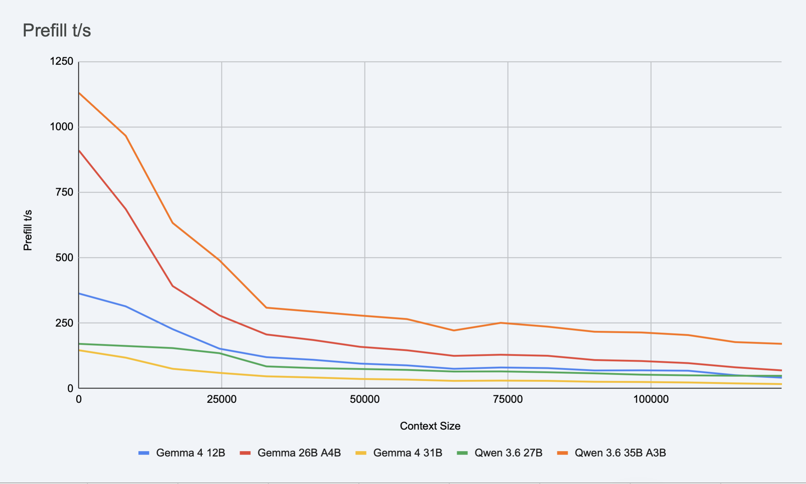
  <figcaption><strong>Figure 4:</strong> Prefill processing speed across context sizes (0–124k tokens) for Gemma 4 (12B, 26B, 31B) and Qwen 3.6 (27B, 35B A3B) models with MTP enabled.</figcaption>
</figure>

Decode:

<figure>
  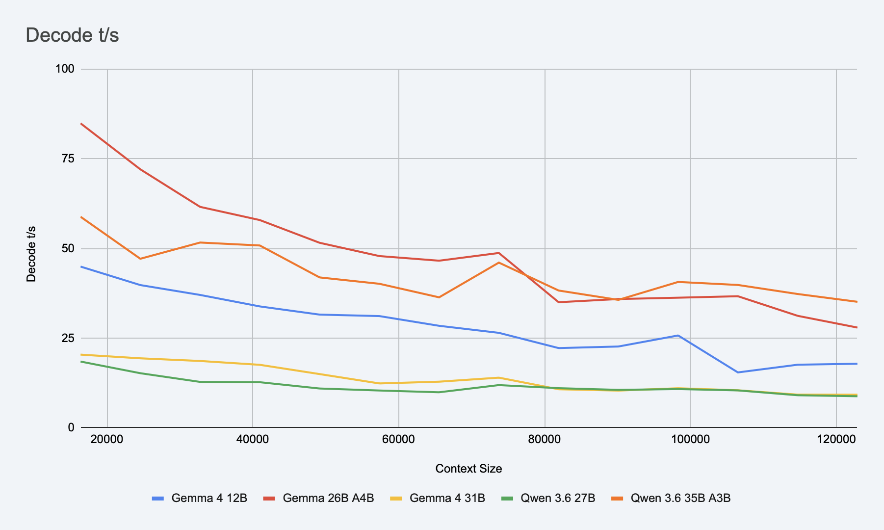
  <figcaption><strong>Figure 5:</strong> Token generation decode speed across context sizes (16k–124k tokens) for Gemma 4 (12B, 26B, 31B) and Qwen 3.6 (27B, 35B A3B) models with MTP enabled.</figcaption>
</figure>

Table data (all models had MTP enabled):

| Context Size (tokens) | G 12B Prefill (t/s) | G 12B Decode (t/s) | G 26B Prefill (t/s) | G 26B Decode (t/s) | G 31B Prefill (t/s) | G 31B Decode (t/s) | Q 27B Prefill (t/s) | Q 27B Decode (t/s) | Q 35B Prefill (t/s) | Q 35B Decode (t/s) |
| --- | --- | --- | --- | --- | --- | --- | --- | --- | --- | --- |
| 0 | 363.19 |  | 909.72 |  | 146.25 |  | 170.77 |  | 1129.97 |  |
| 8192 | 314.09 |  | 685.73 |  | 118.02 |  | 162.69 |  | 965.95 |  |
| 16384 | 226.89 | 44.91 | 391.79 | 84.82 | 75.39 | 20.38 | 154.54 | 18.45 | 633.05 | 58.79 |
| 24576 | 152.26 | 39.76 | 279.24 | 72.01 | 59.86 | 19.35 | 135.03 | 15.20 | 490.05 | 47.09 |
| 32768 | 119.91 | 37.01 | 206.61 | 61.55 | 46.62 | 18.61 | 84.61 | 12.78 | 308.90 | 51.61 |
| 40960 | 109.86 | 33.81 | 185.50 | 57.87 | 42.17 | 17.54 | 78.15 | 12.69 | 294.08 | 50.79 |
| 49152 | 95.29 | 31.53 | 159.34 | 51.54 | 36.63 | 14.96 | 74.71 | 10.94 | 279.03 | 41.89 |
| 57344 | 88.51 | 31.12 | 146.19 | 47.84 | 34.18 | 12.35 | 71.22 | 10.38 | 265.41 | 40.12 |
| 65536 | 75.38 | 28.41 | 124.86 | 46.55 | 29.23 | 12.84 | 64.95 | 9.89 | 221.89 | 36.34 |
| 73728 | 80.38 | 26.45 | 129.18 | 48.70 | 30.25 | 13.96 | 65.39 | 11.89 | 251.03 | 46.02 |
| 81920 | 78.02 | 22.20 | 125.21 | 34.98 | 29.37 | 10.73 | 62.18 | 11.03 | 236.51 | 38.24 |
| 90112 | 69.03 | 22.64 | 108.98 | 35.87 | 25.80 | 10.36 | 58.04 | 10.56 | 217.08 | 35.63 |
| 98304 | 69.56 | 25.72 | 105.13 | 36.24 | 24.97 | 11.01 | 52.96 | 10.78 | 214.24 | 40.63 |
| 106496 | 68.07 | 15.42 | 97.08 | 36.65 | 23.16 | 10.44 | 50.33 | 10.41 | 204.35 | 39.79 |
| 114688 | 50.92 | 17.57 | 81.15 | 31.19 | 19.68 | 9.23 | 48.91 | 9.06 | 177.48 | 37.27 |
| 122880 | 41.54 | 17.84 | 69.28 | 27.92 | 17.07 | 9.21 | 48.65 | 8.78 | 170.87 | 35.10 |


> **Note (1):** All models have MTP enabled.
>
> **Note (2):** Decode is blank for the first 16k context. System prompt and prompt were about 16k, so it was doing prefill for the first 16k or so.
>
> **Note (3):** Tests were done on a MacBook connected to power, on a docking station, but without explicit thermal control.
>
> **Note (4):** I ran tests a few times, and they looked fairly similar. I didn't average them, but took one of the samples for each of the models.
>
> **Note (5):** Data in the table aggregated from logs, values in each bucket represent average of all values in particular bucket for given model.

As you can see, Qwen 3.6 35B A3B is still holding up fairly well at 124k with 35.10 t/s, and Gemma 4 26B A4B with 27.92 t/s. Qwen 3.6 35B A3B has faster prefill, but slower decode in the beginning (first 70k context or so). Gemma 4 26B A4B has slower prefill and faster decode for the first 70k context, and then becomes slower than Qwen 3.6 35B A3B.

Worth noting, performance is not dropping off the cliff after 124k context. In tests with real data I seen 33.77 t/s at 131k, 31.90 t/s at 147k, 30.10 t/s at 163k. These are few sample points.

### MTP vs No-MTP for large contexts

I was also reading about MTP degradation at larger contexts, so I had to try it out:

Prefill:

<figure>
  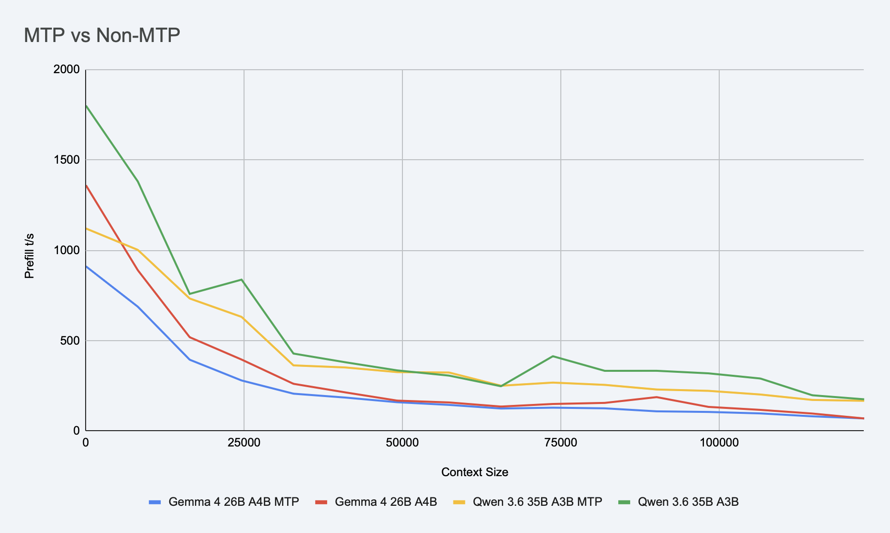
  <figcaption><strong>Figure 6:</strong> Prefill speed comparison between MTP and base non-MTP variants on syntetic test across 0–124k context for Qwen 3.6 35B A3B and Gemma 4 26B A4B.</figcaption>
</figure>

Decode:

<figure>
  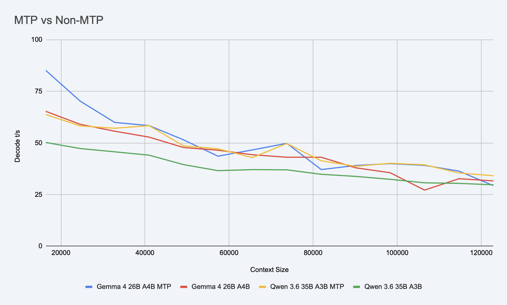
  <figcaption><strong>Figure 7:</strong> Decode generation speed comparison between MTP and base non-MTP variants on syntetic test across 0–124k context for Qwen 3.6 35B A3B and Gemma 4 26B A4B.</figcaption>
</figure>

Qwen 3.6 35B A3B MTP version decode speed holds higher than the base version even on 124k context. With small context I can see as much as +68% speed increase. +13% at 100k and +14% at 165k.

Gemma 4 26B A4B also holds up initially, but after 50k it performs similar or worse than base version.

Worth noting, MTP improves decoding speed, but costs prefill. Especially at small contexts non-MTP wins over MTP by the factor of 2-3. But around 45k the difference becomes almost indistinguishable.

So it seems like it still makes sense. But it may be worth testing full task completion time in different scenarios. In this scenario, for example, Qwen 3.6 35B A3B MTP total execution time was 00:17:36, while base version Qwen 3.6 35B A3B completed tests in 00:19:38.

To be sure, I re-ran tests for Qwen 3.6 35B A3B only on real task:

Prefill:

<figure>
  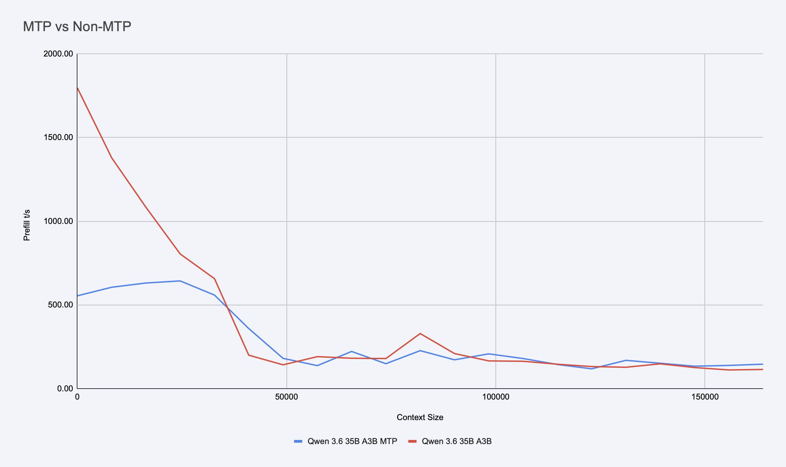
  <figcaption><strong>Figure 8:</strong> Prefill speed comparison between MTP and base non-MTP variants on real task across 0–163k context for Qwen 3.6 35B A3B.</figcaption>
</figure>

Decode:

<figure>
  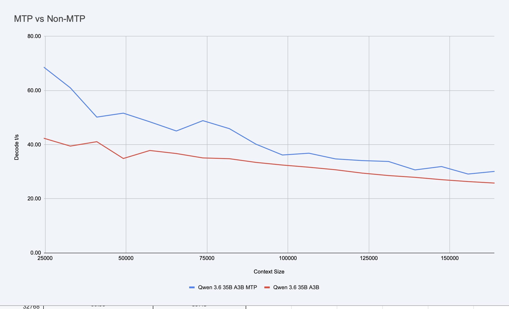
  <figcaption><strong>Figure 9:</strong> Decode generation speed comparison between MTP and base non-MTP variants on real task across 0–163k context for Qwen 3.6 35B A3B.</figcaption>
</figure>

Wall time was about 35 minutes for MTP variant, and 43 minutes for non-MTP variant (NOTE: this was larger real task, and some time spent on actual builds and tests, so it is different from the synthetic test I did initially, which was only sending messages to the model from test suite).

One interesting finding about MTP and agentic coding: token decoding is not that important; prefill is more important. The harness sends a lot of data to the model which it needs to process. So for agentic tasks, 2.5x decoding speed would not translate to 2.5x task completion time.

I never compared code quality in MTP vs non-MTP. Initially I tested the quality of different models, but then I switched to MTP and ensured quality was sufficient for MTP versions; I never went back to test quality of MTP vs non-MTP.

### q8_0 and TurboQuants

Another idea was to try using a smaller cache by using `q8_0` for KV Cache, or using TurboQuants. KV-Cache is the second largest contributor to the total memory usage after the model itself. For models like Qwen 3.6 27B, I can reduce 10.5GB of KV Cache to 5GB.

I tried running `q8_0` for cache and performance dropped significantly. Seems like on Apple Silicon (or at least on M2 chips) `f16` is handled much faster for KV Cache decoding.

I was thinking it might still make sense for quantization of larger models for larger contexts, so I tested `unsloth/Qwen3.6-27B-MTP` at `q8_0`, and `unsloth/gemma-4-31B-it-qat` at `q8_0`. Unfortunately in the first run, both models dropped to very low t/s after 40k context, and my tests timed out for both models multiple times.

I was able to get data only for `unsloth/Qwen3.6-27B-MTP` for the full 124k context size.

So I re-tested unsloth/Qwen3.6-27B-MTP with real task and slightly larger context.

Prefill:

<figure>
  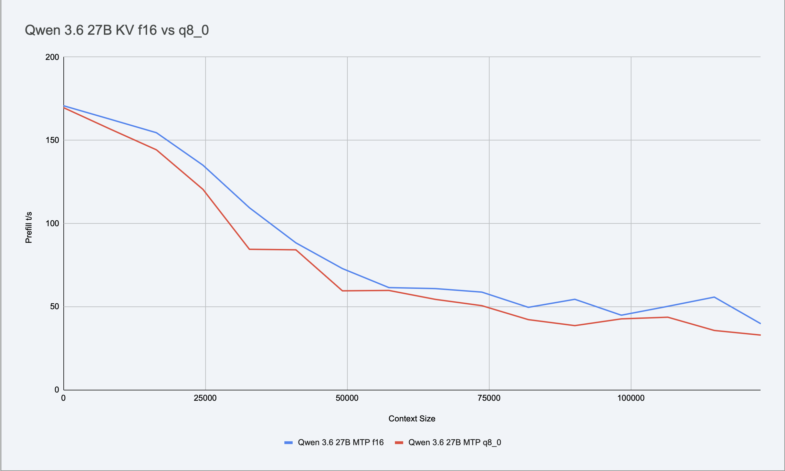
  <figcaption><strong>Figure 10:</strong> Prefill speed comparison between f16 and q8_0 KV Cache for unsloth/Qwen3.6-27B-MTP across 0–132k context.</figcaption>
</figure>

Decode:

<figure>
  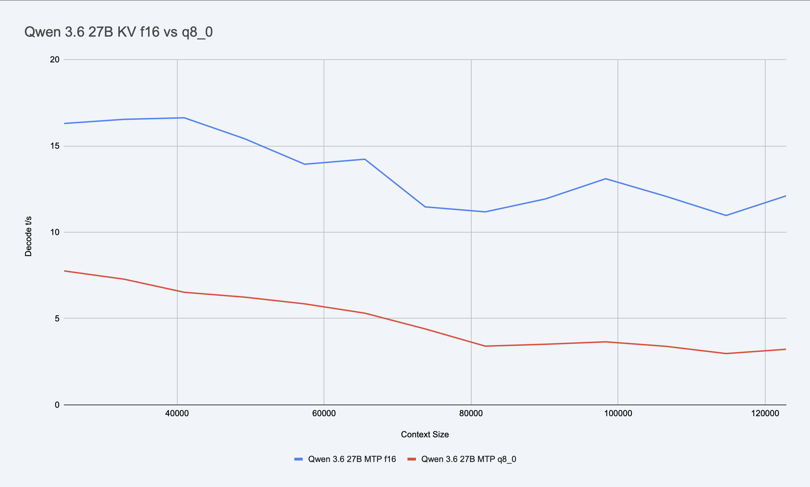
  <figcaption><strong>Figure 11:</strong> Decode generation speed comparison between f16 and q8_0 KV Cache for unsloth/Qwen3.6-27B-MTP across 0–132k context.</figcaption>
</figure>

Prefill is slower at every point for q8_0 compared to f16. Decode is about 2x slower in the beginning, and about 4x slower close to 128k.

So as it seems, decode penalty for q8_0 grows with context size. Not sure why.

I initially ran the test for q8_0 on the same tasks as MTP vs non-MTP, but there was not enough data to actually confirm it is 2x slower on decode, as I had fewer data points. So I re-ran the tests on real task. And also was able to measure wall time. Qwen 3.6 27B with f16 KV-Cache completed task in 01:23:17. And the same model with q8_0 KV-Cache completed task in 02:51:01. Which is ~2x slower. Which is really not worth 5GB RAM saving.

I ran the tests on main llama.cpp build. But also switched to TurboQuants branch to test other quantization methods. I tried using `--cache-type-k q8_0 --cache-type-v turbo3` on large dense models (Qwen 3.6 27B and Gemma 4 31B) and `--cache-type-k q8_0 --cache-type-v turbo2` on large MoE models (Qwen 3.6 35B A3B and Gemma 4 26B A4B). And I saw performance even worse than on `q8_0`.

It seems like on M2 chips the introduction of any KV Cache compression adds significant compute overhead. And if we try to optimize KV Cache size by implementing heavier decoding, we only make performance worse.

> **Note:** Tests were done around the first week of July 2026, from `master` branch of llama.cpp for q8_0 and `feature/turboquant-kv-cache` of [/TheTom/llama-cpp-turboquant](https://github.com/TheTom/llama-cpp-turboquant) for TurboQuant tests.

### DFlash

Once DFlash was merged, I tried using it with both `unsloth/qwen3.6-35b-a3b-mtp` and `unsloth/gemma-4-26B-A4B-it-qat`. And I got a terrible acceptance rate (<8%) and very low speed. I used DFlash files trained on base models `google/gemma-4-26B-A4B` and `Qwen/Qwen3.6-35B-A3B`. With Unsloth changes in weights, DFlash models can't make good predictions and performance sinks. Will need to see when the Unsloth team produces DFlash models dedicated to their variations.

## Workflow

After all optimization attempts, I was able to get a fairly stable combination of models, applications, and harness.

Models:

- `unsloth/qwen3.6-35b-a3b-mtp` - 35-70 t/s - primary model for coding
- `unsloth/Qwen3.6-27B-MTP` - 8-18 t/s - slow model, for QA or planning
- `unsloth/gemma-4-26B-A4B-it-qat` - 27-84 t/s - alternative coding model
- `unsloth/gemma-4-31B-it-qat` - 9-20 t/s - alternative QA model
- `unsloth/gemma-4-E4B-it-qat` - 40-115 t/s - fast model

One note: once in a while Gemma 4 26B A4B would go into an infinite loop and wouldn't stop its chain of thought. Happens rarely, but I noticed it a few times.

Application: `llama.cpp` with a custom Zsh script to start/stop/show status/show logs/etc.

Harness: Qwen Code. Works great. Awesome for Qwen models. But also now works well with Gemma 4 models too.

Workflow for simpler tasks:

1. Write prompt
2. Execute it in Qwen Code using `unsloth/qwen3.6-35b-a3b-mtp`

Workflow for medium tasks:

1. Write prompt for implementation and QA
2. Execute it in Qwen Code using `unsloth/qwen3.6-35b-a3b-mtp`
3. Run QA in a separate instance of Qwen Code using `unsloth/qwen3.6-35b-a3b-mtp`, `unsloth/Qwen3.6-27B-MTP` or `unsloth/gemma-4-26B-A4B-it-qat`. QA agent Qwen 3.6 35B A3B may make the same mistakes as the implementation agent using the same model. So Qwen 3.6 27B may catch it because it may be smarter about it, or Gemma 4 26B A4B may catch it because it has different training than Qwen models.

Workflow for more complex tasks:

1. Write prompt for Claude Opus 4.8 in Claude Code to write spec and prompts for implementer and QA.
2. Same as in previous case.

## Cache

One thing I found useful is the ability to save and restore cache using the llama.cpp API.

I can run the implementer agent to get to completion, then call `POST /slots/{id_slot}?action=save` API to save it to disk.

Start a new instance of Qwen Code and run the QA agent to get code and results reviewed. Once it is done, save cache to disk, load implementer model and restore cache (you need to keep separate files per model). And then paste feedback to implementer CLI. It will skip the expensive prefill stage and will continue as if it just finished.

Once implementer is done, save cache to disk, unload model, load QA model, load QA model cache. Continue...

This allows loading a cache with 100k context in seconds (a few GB can be saved to disk or read in <5 seconds), rather than waiting 20-50 minutes to re-process context from scratch.

## Final model testing

After solving all issues, I did final model testing. Used the following models for testing:

- Sonnet 5 @ High in claude code
- Gemini 3.6 Flash High in agy (Antigravity CLI)
- Gemini 3.6 Flash Medium in agy
- Qwen 3.6 27B in opencode
- Qwen 3.6 35B A3B in opencode
- Gemma 4 26B A4B in opencode

llama.cpp arguments:

* Gemma (E4B) — router 1, port 8132:

```bash
llama-server \
  --model ~/.cache/huggingface/hub/models--unsloth--gemma-4-E4B-it-qat-GGUF/snapshots/8c5a9e4fd5482e2be20fe0bf013b4c262a8f4265/gemma-4-E4B-it-qat-UD-Q4_K_XL.gguf \
  --alias unsloth/gemma-4-E4B-it-qat \
  -ngl 99 \
  -fa on \
  -b 2048 \
  -ub 2048 \
  -t 8 \
  --host 0.0.0.0 \
  --port 8132 \
  --offline \
  --jinja \
  --slot-save-path ~/.cache/llama-server/router-cache-1 \
  -c 65536 \
  -np 1 \
  --cache-type-k f16 \
  --cache-type-v f16 \
  --mmproj ~/.cache/huggingface/hub/models--unsloth--gemma-4-E4B-it-qat-GGUF/snapshots/8c5a9e4fd5482e2be20fe0bf013b4c262a8f4265/mmproj-F16.gguf \
  --temp 0.6 \
  --top-p 0.95 \
  --top-k 64 \
  --reasoning on \
  --no-context-shift \
  --load-mode none \
  --model-draft ~/.cache/huggingface/hub/models--unsloth--gemma-4-E4B-it-qat-GGUF/snapshots/8c5a9e4fd5482e2be20fe0bf013b4c262a8f4265/mtp-gemma-4-E4B-it.gguf \
  --spec-type draft-mtp \
  --spec-draft-n-max 3

```

* Gemma (26B-A4B) — router 2, port 8133:

```bash
llama-server \
  --model ~/.cache/huggingface/hub/models--unsloth--gemma-4-26B-A4B-it-qat-GGUF/snapshots/7b92b5b28818151e8669af2e45e88d6086f490dd/gemma-4-26B-A4B-it-qat-UD-Q4_K_XL.gguf \
  --alias unsloth/gemma-4-26B-A4B-it-qat \
  -ngl 99 \
  -fa on \
  -b 2048 \
  -ub 2048 \
  -t 8 \
  --host 0.0.0.0 \
  --port 8133 \
  --offline \
  --jinja \
  --slot-save-path ~/.cache/llama-server/router-cache-2 \
  -c 262144 \
  -np 1 \
  --cache-type-k f16 \
  --cache-type-v f16 \
  --mmproj ~/.cache/huggingface/hub/models--unsloth--gemma-4-26B-A4B-it-qat-GGUF/snapshots/7b92b5b28818151e8669af2e45e88d6086f490dd/mmproj-F16.gguf \
  --temp 0.6 \
  --top-p 0.95 \
  --top-k 64 \
  --reasoning on \
  --no-context-shift \
  --load-mode none \
  --model-draft ~/.cache/huggingface/hub/models--unsloth--gemma-4-26B-A4B-it-qat-GGUF/snapshots/7b92b5b28818151e8669af2e45e88d6086f490dd/mtp-gemma-4-26B-A4B-it.gguf \
  --spec-type draft-mtp \
  --spec-draft-n-max 3 \
  --cache-ram 16384

```

* Qwen (Qwen3.6-35B-MoE) — router 2, port 8133:

```bash
llama-server \
  --model ~/.cache/huggingface/hub/models--unsloth--Qwen3.6-35B-A3B-MTP-GGUF/snapshots/5bc3e238d916f48a861bac2f8a1990a0e9b7e98d/Qwen3.6-35B-A3B-UD-Q4_K_XL.gguf \
  --alias unsloth/Qwen3.6-35B-A3B-MTP \
  -ngl 99 \
  -fa on \
  -b 2048 \
  -ub 2048 \
  -t 8 \
  --host 0.0.0.0 \
  --port 8133 \
  --offline \
  --jinja \
  --slot-save-path ~/.cache/llama-server/router-cache-2 \
  -c 204800 \
  -np 1 \
  --cache-type-k f16 \
  --cache-type-v f16 \
  --mmproj ~/.cache/huggingface/hub/models--unsloth--Qwen3.6-35B-A3B-MTP-GGUF/snapshots/5bc3e238d916f48a861bac2f8a1990a0e9b7e98d/mmproj-F16.gguf \
  --temp 0.6 \
  --top-p 0.95 \
  --top-k 20 \
  --min-p 0.00 \
  --repeat-penalty 1.0 \
  --presence-penalty 0.0 \
  --swa-full \
  --load-mode none \
  --no-context-shift \
  --reasoning on \
  --reasoning-preserve \
  --spec-type draft-mtp \
  --spec-draft-n-max 3

```

* Qwen (Qwen3.6-27B-Dense) — router 2, port 8133:

```bash
llama-server \
  --model ~/.cache/huggingface/hub/models--unsloth--Qwen3.6-27B-MTP-GGUF/snapshots/5cb35eb3dcbf52dbce5f87dbc64df6aaffadcace/Qwen3.6-27B-UD-Q4_K_XL.gguf \
  --alias unsloth/Qwen3.6-27B-MTP \
  -ngl 99 \
  -fa on \
  -b 2048 \
  -ub 2048 \
  -t 8 \
  --host 0.0.0.0 \
  --port 8133 \
  --offline \
  --jinja \
  --slot-save-path ~/.cache/llama-server/router-cache-2 \
  -c 262144 \
  -np 1 \
  --cache-type-k f16 \
  --cache-type-v f16 \
  --mmproj ~/.cache/huggingface/hub/models--unsloth--Qwen3.6-27B-MTP-GGUF/snapshots/5cb35eb3dcbf52dbce5f87dbc64df6aaffadcace/mmproj-F16.gguf \
  --temp 0.6 \
  --top-p 0.95 \
  --top-k 20 \
  --min-p 0.00 \
  --repeat-penalty 1.0 \
  --presence-penalty 0.0 \
  --swa-full \
  --load-mode none \
  --no-context-shift \
  --reasoning on \
  --reasoning-preserve \
  --spec-type draft-mtp \
  --spec-draft-n-max 3

```

I chose a fairly complex C# problem, which involved code refactoring, new tests, improvements, and requirements to preserve behavior.

The first round was with a normal prompt, describing what to do and how. Sonnet 5 did it perfectly. Gemini 3.6 Flash did well, but had some small mistakes here and there. Surprisingly Qwen 3.6 27B did fairly well. Not as good as Gemini or Sonnet, but it did well. Qwen 3.6 35B A3B finished the work, tests were green, code refactored, but there were many bugs which made it broken. Gemma 4 26B A4B was not able to finish the work. It did some edits, created files, but then failed to fix the code it broke. And then went into an infinite loop of reasoning.

So for the next round, I improved the prompt with very specific gates on what needed to be done, how to judge if the work was completed, and how to self-test it.

> Note(1) - 27B drop: I decided to exclude Qwen 3.6 27B from round 2 of the tests. The reason was its performance.
>
> Note(2): I was working on improvements in prompt, so next few rounds had more and more complex prompt to make sure weaker model can perform well.

Sonnet 5 was not lightning fast, but it did fairly well. It completed the task in about 19-20 minutes. Gemini 3.6 Flash was faster at 13-14 minutes. Qwen 3.6 35B A3B was about 2-3 times slower. It would complete tasks in 39-56 minutes.

But Qwen 3.6 27B would take close to 1 hour and 50 minutes.

I re-ran tests with better gates, asking the agent to evaluate its performance against a few more criteria. Sonnet 5 did the best, slightly better than the first time. Gemini 3.6 Flash did much better too, closer to Sonnet 5. And Qwen 3.6 35B A3B did very well. Not great, but closer to frontier models. Gemma 4 26B A4B again was not able to finish. Worth noting, this was not model improvements, but prompting improvements, defining goals better, adding guardrails, gates.

I made quite a few attempts to get Gemma 4 26B A4B to finish the test. I tried to add repeat penalty, lower temperature, add DRY (do not repeat yourself), but nothing helped. It would finish like 50% of the work writing code, maybe attempt to build code a few times, and then go into an infinite spiral of reasoning starting around 60-80k context, and would completely stop making any progress after 140k to 195k of context—from which it would not be able to recover, even if I stopped it and intervened.

I do not know exact reason why Gemma 4 colapses, may be wrong tool use and attempts to fix its mistakes causing it to go into infinite reasoning loop at higher context values. I really tried to make it work. It is pity it was not able to complete any complex tasks.

After abandoning attempts to get any results from Gemma 4 26B A4B, I re-tested Qwen 3.6 35B A3B to get more consistent quality and time. Quality was very good. But as for time, the fastest would still be 40 minutes, but closer to 55-65 minutes. I think I would accept a model 3x slower that is able to produce code close to frontier models in quality while running locally.

> **Note — Quality measurements:** I will not get into the details, but in short, I had a particular task, and I knew how I wanted it to be done. I ran code reviews through cloud models, asking to write a scoring system that would match what I wanted from the refactoring. Once I had this framework, after each run, I'd use Claude Opus 4.8 to judge diffs against the scoring system I wrote. This makes the judge slightly biased toward one of the models (Sonnet), but I did some ad-hoc checks with Gemini 3.1 Pro, which agreed with Claude Opus 4.8 assessment.

One more note about harness, I used OpenCode for final testing to ensure it works well with both Qwen 3.6 and Gemma 4. I do still prefer Qwen Code, but it is a matter of preference.

**Conclusion**: Qwen 3.6 35B A3B is less capable than Qwen 3.6 27B or Sonnet 5 / Gemini 3.6 Flash. But with some prompt engineering it can produce high quality code. Still, it is at least 3 times slower than cloud models like Sonnet 5. But main question: is it worth it? Maybe. If I could run Qwen 3.6 27B at 50 t/s at 200k context on my Mac, it would be a very viable option, and I'd use it more than cloud models. But Qwen 3.6 35B A3B requires more work on prompting and better specs so it can do work well, which may be acceptable—though it won't replace cloud subscriptions completely. I'd say a Pro subscription + Qwen 3.6 35B A3B can work together to stretch limits through the week by using the cloud subscription for planning and verification, and Qwen for implementation.
